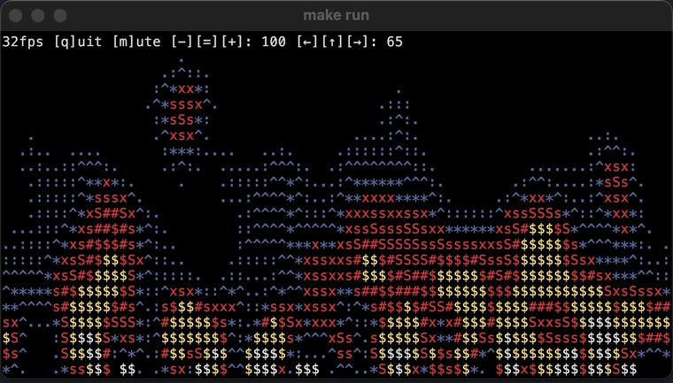

# Flame

A terminal DOOM fire animation and ASCII art CLI written in Go, built with Charm's Bubble Tea and Lip Gloss TUI libraries.

## Demo



## Table of Contents

- [Requirements](#requirements)
- [Features](#features)
- [Usage](#usage)
- [Dependencies](#dependencies)
- [Project Structure](#project-structure)
- [How it Works](#how-it-works)
- [Customization](#customization)
- [License](#license)

## Requirements

- [Go 1.26+](https://go.dev/dl/)

## Features

- Real-time 2D fire simulation based on the classic DOOM fire effect
- Colorful, animated terminal output for modern terminal emulators
- Hot-resizable output
- Hardwired 30 FPS ASCII rendering up to 4K (3829x700 with [kitty](https://github.com/kovidgoyal/kitty))

## Usage

### Clone

```sh
git clone https://github.com/erik-adelbert/flame.git
cd flame
```

### Run with Makefile

```sh
make run
```

Build the executable:

```sh
make build
./bin/flame
```

### Install with go install

```sh
go install github.com/erik-adelbert/flame/cmd/flame@latest
```

### Test and benchmark

```sh
make test
make bench
```

### Run without Makefile

```sh
go run ./cmd/flame
```

Build a binary:

```sh
mkdir -p bin
go build -o bin/flame ./cmd/flame
./bin/flame
```

## Dependencies

- [Bubble Tea](https://github.com/charmbracelet/bubbletea)
- [Lip Gloss](https://github.com/charmbracelet/lipgloss)
- [Go terminal support](https://pkg.go.dev/golang.org/x/term)

## Project Structure

- `cmd/flame/` — CLI entry point (`main` package)
- `flame/` — Core simulation and rendering logic

## How it Works

- The model simulates fire by propagating heat values upward and mapping them to characters/colors.

## Customization

- Adjust the palette or rules in `flame/model.go` to change the flame's appearance.
- Change grid size or simulation parameters as needed.

## License

MIT. See [LICENSE](LICENSE.TXT).

## Author

Erik Adelbert

Note: I don't need to vibe my code. This project is crafted.
